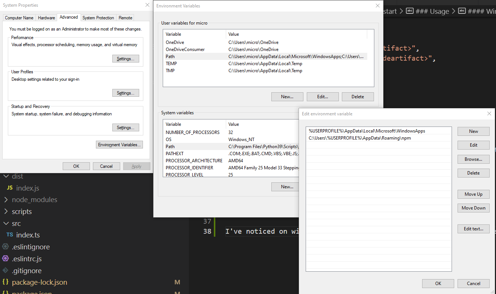

# aws-codeartifact-auth

This repo houses a CLI tool and custom github action for authenticating npm with AWS codeartifact

## Quickstart

### Github Action

#### Usage

The below action will setup npm with the codeartifact registry scoped to the referenced package.

```yaml
- name: npm codeartifact login
  uses: MondoPower/codeartifact-auth@1.1.7
  with:       
    domain: "<domain-in-aws-codeartifact>"
    repository: "<repository-in-codeartifact>"
    scope: "<Package Scope"
    region: "<AWS Region>"
    accountId: "<AWS AccountId>"
```

### CLI

#### Usage

Recommended for local usage, refer to the github action above for CI runners. 

Add the following to package.json:

```json
{
    "awsCodeArtifact": {
      "domain": "<domain-in-aws-codeartifact>",
      "repository": "<repository-in-codeartifact>",
      "scope": "<scope>",
      "region": "<aws-region>",
      "accountId": "<aws-account-id>"
    }
  }
}
```

Once you've added the config to your package.json. You will need to assumerole/set your aws credentials within your running context (CI/Terminal).

Then run ```codeartifact-auth```

It will update your home directories .npmrc file with the scope and token information.

#### Windows Users

If you're using this tool on windows and you have installed it globally, you will need to set the path for npm packages. Otherwise the tool won't be picked up in your path.

Make sure you add it to your system path

e.g. ```%USERPROFILE%\AppData\Roaming\npm```

example



Command usage on windows:

```codeartifact-auth.cmd```


### Testing CLI locally
- npm link
- build
- run ```codeartifact-auth```


### Potential extensions/improvements

- CLI Tool to take a config or argument list
- CLI/Github action support for removing scope. This is useful for users that want all their packages pulled via codeartifact instead of just privately scoped ones.
